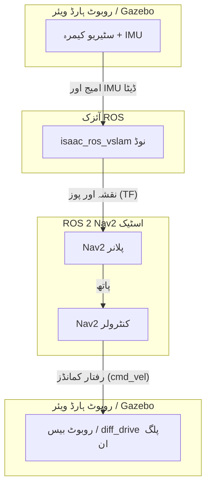

# سبق 16.2: آئزک ROS VSLAM

**SLAM** (Simultaneous Localization and Mapping) موبائل روبوٹکس میں سب سے بنیادی مسائل میں سے ایک ہے۔ یہ ایک نامعلوم ماحول کا نقشہ بنانے کا عمل ہے جبکہ بیک وقت اس نقشے کے اندر روبوٹ کی پوزیشن پر نظر رکھنا۔

**VSLAM** (ویژول SLAM) SLAM الگورتھم کی ایک قسم ہے جو کیمرہ امیجز کو اپنے بنیادی سینسر ان پٹ کے طور پر استعمال کرتی ہے۔

`isaac_ros_vslam` پیکیج VSLAM کے لیے NVIDIA کا GPU-ایکسلریٹڈ حل ہے۔ اسے NVIDIA کے ایمبیڈڈ Jetson پلیٹ فارمز پر اعلیٰ کارکردگی کے لیے ڈیزائن کیا گیا ہے۔

## یہ کیسے کام کرتا ہے۔

`isaac_ros_vslam` نوڈ دو اہم ان پٹ لیتا ہے:
1.  **سٹیریو امیجز:** بائیں اور دائیں کیمرے سے مطابقت پذیر امیجز کا ایک جوڑا۔ دو امیجز کے درمیان نقطہ نظر میں ہلکا سا فرق الگورتھم کو گہرائی کا حساب لگانے کی اجازت دیتا ہے۔
2.  **IMU ڈیٹا:** Inertial Measurement Unit سے ڈیٹا، جو روبوٹ کی واقفیت اور سرعت کے بارے میں معلومات فراہم کرتا ہے۔

ان ان پٹس سے، یہ دو کلیدی آؤٹ پٹ تیار کرتا ہے:
1.  **پوز (`/tf`):** روبوٹ کی ریئل ٹائم تخمینہ شدہ پوزیشن اور واقفیت۔ یہ اسے ایک مقررہ `odom` فریم سے روبوٹ کے `base_link` فریم میں ایک ٹرانسفارم کے طور پر شائع کرتا ہے۔
2.  **نقشہ (`/map`):** ماحول کی 3D ساخت کی نمائندگی کرنے والا ایک پوائنٹ کلاؤڈ جسے روبوٹ نے اب تک دیکھا ہے۔

## Nav2 کے ساتھ انٹیگریشن

`isaac_ros_vslam` کا آؤٹ پٹ معیاری ROS 2 نیویگیشن اسٹیک، **Nav2** کے لیے ڈراپ ان ان پٹ کے طور پر ڈیزائن کیا گیا ہے۔

Nav2 ایک انتہائی قابل ترتیب نظام ہے جو پاتھ پلاننگ اور رکاوٹوں سے بچنے کو سنبھالتا ہے۔ اسے کام کرنے کے لیے دو چیزوں کی ضرورت ہوتی ہے: دنیا کا نقشہ اور اس نقشے کے اندر روبوٹ کی موجودہ پوز۔ Isaac ROS VSLAM دونوں فراہم کرتا ہے۔

ڈیٹا فلو اس طرح نظر آتا ہے:

1.  سٹیریو کیمرہ اور IMU (یا تو حقیقی یا Gazebo/Isaac Sim میں سمیولیٹڈ) اپنا ڈیٹا شائع کرتے ہیں۔
2.  `isaac_ros_vslam` نوڈ اس ڈیٹا کو سبسکرائب کرتا ہے۔
3.  VSLAM نوڈ GPU پر ڈیٹا پر کارروائی کرتا ہے اور روبوٹ کے پوز کو TF ٹرانسفارم کے طور پر اور نقشے کو پوائنٹ کلاؤڈ کے طور پر شائع کرتا ہے۔
4.  Nav2 اسٹیک لمبی رینج کی منصوبہ بندی کے لیے نقشہ اور لوکلائزیشن کے لیے TF ٹرانسفارم استعمال کرتا ہے۔
5.  جب ایک مقصد دیا جاتا ہے، تو Nav2 پلانر نقشے کے ذریعے ایک پاتھ بناتا ہے۔
6.  Nav2 کنٹرولر پاتھ کی پیروی کرنے کے لیے `Twist` پیغامات تیار کرتا ہے، انہیں `/cmd_vel` پر شائع کرتا ہے۔
7.  روبوٹ کا ڈیفرینشل ڈرائیو کنٹرولر `/cmd_vel` پیغامات وصول کرتا ہے اور روبوٹ کو حرکت دیتا ہے۔

Isaac ROS کے GPU-ایکسلریٹڈ پرسیپشن اور Nav2 کی اعلیٰ سطحی منصوبہ بندی کے درمیان یہ سخت انٹیگریشن ایمبیڈڈ ہارڈ ویئر پر مضبوط، اعلیٰ کارکردگی والے خود مختار نیویگیشن سسٹمز کی تخلیق کی اجازت دیتا ہے۔
